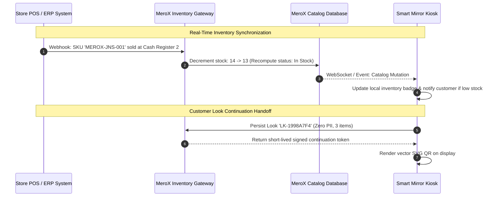

# MEROX SMART MIRROR — PRODUCTION DEPLOYMENT & STORE PILOT SPECIFICATION
## Comprehensive Architecture, Hardware, Integration & Pilot Manual

**Platform:** MEROX AI Smart Mirror & Personal Style Assistant  
**Creator & Platform Owner:** Kishan Kumar Singh  
**Release Engineering Standard:** Production-Oriented Pilot Ready (Phase 13 + Phase 14)  

---

## 1. System Architecture Overview

```mermaid
graph TD
    subgraph Store_Kiosk_Hardware [Physical Store Smart Mirror Kiosk]
        DISPLAY[55" 4K 500-Nit Commercial Portrait Display]
        GLASS[Two-Way Dielectric Mirror Glass 70/30]
        TOUCH[10-Point PCAP Touch Interface]
        CAM[1080p 60fps Wide-Angle UVC Camera]
        PC[Intel Mini PC - Chromium Kiosk Mode]
        SCANNER_HW[USB HID Barcode Scanner / Camera Viewfinder]
        
        CAM --> PC
        TOUCH --> PC
        SCANNER_HW --> PC
        PC --> DISPLAY
        DISPLAY -.-> GLASS
    end

    subgraph Edge_Runtime [Kiosk Client Application Layer]
        DASH[dashboard.html / dashboard.js<br/>Locked Kishan Kumar Singh Visual Baseline]
        SESSION[session.js<br/>Isolated SESS-ID Lifecycle & Auto Inactivity Reset]
        TRYON[camera.js<br/>2D AR Accessory Alignment & EMA Filter]
        ROX[rox-ai.js<br/>Offline Domain Expert + Controlled Actions]
        ADMIN[admin.html / admin.js<br/>Store Admin & Inventory Controller]
    end

    subgraph Cloud_Infrastructure [Production Cloud Services]
        CDN[Edge CDN: Global HTTPS & Asset Caching]
        AUTH_SRV[Firebase Authentication / Custom Claims RBAC]
        DB[(Cloud Firestore / PostgreSQL - Store Inventory & Schema)]
        STORAGE_BUCKET[Cloud Storage: Product Images & 2D AR Overlays]
        AI_GATEWAY[Server-Side Secure Gemini Proxy with Rate Limits]
        ANALYTICS_SRV[Privacy-Safe Telemetry Aggregator - Zero PII]
    end

    subgraph Mobile_Shopper_Handoff [Customer Mobile Device]
        QR_SCAN[Phone Camera Scans Anonymous QR]
        MOBILE_LOOK[look.html Mobile Curated Lookbook]
    end

    PC --> DASH
    DASH --> SESSION
    DASH --> TRYON
    DASH --> ROX
    DASH -.-> ADMIN
    
    DASH --> CDN
    SESSION --> AUTH_SRV
    SESSION --> DB
    SESSION --> STORAGE_BUCKET
    ROX --> AI_GATEWAY
    SESSION --> ANALYTICS_SRV
    
    SESSION --> QR_SCAN
    QR_SCAN --> MOBILE_LOOK
    MOBILE_LOOK --> DB
```

---

## 2. Hardware Engineering Specifications for Real Smart Mirror

| Component | Minimum Specification | Recommended Production Choice | Rationale |
| :--- | :--- | :--- | :--- |
| **Display Panel** | 50" 1080p 350-nit | **55" 4K UHD (3840×2160) 500-nit Portrait Industrial Panel** (LG / Samsung Commercial) | High ambient mall lighting requires >450 nits to penetrate dielectric glass clearly. |
| **Mirror Surface** | Semi-reflective acrylic | **6mm Toughened Dielectric Two-Way Glass (70% Reflective / 30% Transmissive)** | Prevents optical warping; provides crisp true reflection while maintaining UI contrast. |
| **Touch Sensor** | Optical touch frame | **10-Point Projected Capacitive (PCAP) Touch Foil behind glass** | Vandal-proof, responsive through 6mm glass, immune to external mall lighting interference. |
| **Compute Node** | Intel Core i3 / 8GB RAM | **Intel Core i5/i7 12th+ Gen Mini PC, 16GB DDR4, 256GB NVMe SSD, Fan-cooled** | Smooth 60fps WebRTC video decoding and instantaneous $O(1)$ catalog hashmap filtering. |
| **Webcam / Sensor**| 720p 30fps webcam | **1080p 60fps Wide-Angle (90° FOV) UVC USB Camera with Hardware Privacy Shutter** | Wide horizontal FOV captures full-body outfit and face proportions at 1.2–2.0m distance. |
| **Enclosure** | Wood / Aluminum frame | **Brushed Anodized Aluminum Kiosk Enclosure with Lockable Rear Service Door & VESA Mount** | Commercial durability, forced-air exhaust fan, tamper-resistant access to ports and cables. |
| **Barcode Scanner** | Camera-based only | **Dual Mode: Camera Viewfinder + Zebra / Honeywell 1D/2D Flush-Mount USB Scanner** | Instant 50ms physical tag recognition when garments are presented at mirror base. |
| **Audio** | Internal PC speaker | **Directional Sound Dome / Ultrasonic Acoustic Bar (15W)** | Directs audio prompts exclusively to the shopper without polluting adjacent mall retail space. |

---

## 3. Store POS & ERP Integration Specifications



1. **Inventory Decrement Webhook:**
   - Endpoint: `POST /api/v1/inventory/webhook/pos-event`
   - Headers: `Authorization: Bearer <STORE_SECRET>`, `X-Store-Id: STORE-MUM-01`
   - Payload:
     ```json
     {
       "eventType": "SALE_COMPLETED",
       "timestamp": "2026-09-28T13:00:00Z",
       "storeId": "STORE-MUM-01",
       "items": [
         { "sku": "MEROX-JNS-001", "quantity": 1, "barcode": "8901234000010" }
       ]
     }
     ```
2. **Catalog Import Webhook:**
   - Endpoint: `POST /api/v1/catalog/batch-sync`
   - Supports automated nightly reconciliation against SAP / Oracle Retail ERP via RFC-4180 CSV or JSON payload.
3. **RFID & Electronic Product Code (EPC) Architecture:**
   - **Status:** **FUTURE HARDWARE INTEGRATION** (Honest Classification).
   - The catalog schema includes `rfid` and `rfidEpc` fields. Production RFID requires a UHF RFID antenna array (Impinj Speedway / Zebra FX9600) mounted into the fitting room kiosk frame, communicating via LLRP protocol to emit garment presence events.

---

## 4. Virtual Try-On Reality Matrix (Honest Capability Audit)

| Category | Try-On Implementation | Classification | Commercial Reality |
| :--- | :--- | :--- | :--- |
| **Eyewear & Goggles** (5 Items) | 2D Canvas AR overlay with eye-landmark tilt tracking, EMA jitter smoothing ($\alpha = 0.35$), manual calibration (scale, tilt, offsets). | **PRODUCTION / PILOT READY** | Reliable, fast, zero latency, runs 100% locally in browser without sending video frames to cloud. |
| **Caps & Headwear** (5 Items) | 2D Canvas AR overlay aligned with head bounding box and forehead tracking with tilt compensation. | **PRODUCTION / PILOT READY** | Lightweight and performant for hats, caps, and hair accessories. |
| **Shirts & Denim Bottoms** (10 Items) | Interactive silhouette alignment with BMI sizing recommendation chips (S/M/L/XL) and complete curated outfit builder. | **PROTOTYPE / LOOKBOOK PREVIEW** | Accurately visualizes aesthetic color coordination and sizing. **Commercial 3D cloth simulation / neural texture transfer requires GPU server-side diffusion pipeline.** |
| **Footwear & Sneakers** (5 Items) | Interactive detail card with sole specs, cushioning index, and outfit harmony scoring. | **LOOKBOOK PREVIEW** | Foot tracking from a standing portrait mirror requires low-angle secondary camera. |

---

## 5. Controlled Real-Store Pilot Sequence (8-Stage Rollout)

1. **Stage 1: Internal Laboratory Stress & Soak Test (48 Hours)**
   - Continuous headless interaction loop: 2,000 automated sessions, memory leak monitoring, WebRTC stream start/stop cycles, timer disposal verification.
2. **Stage 2: Staging Mock-Kiosk Setup (1 Week)**
   - Mount test hardware inside simulated retail booth. Verify 500-nit display readability, touch responsiveness through 6mm glass, and ambient lighting camera performance.
3. **Stage 3: Single-Store Flagship Deployment (Floor 2, Phoenix Mall Mumbai)**
   - Install 1 physical Smart Mirror kiosk connected to dedicated store VLAN with 100 Mbps uplink. Tag all 30 baseline garments with EAN-13 barcodes.
4. **Stage 4: Store Staff Training & Operations (2 Days)**
   - Train store managers and sales staff on `#authGateModal` login, stock replenishment buttons (`+1`, `+5`, `Set 0`), and morning diagnostic self-test.
5. **Stage 5: Supervised Customer Trials (2 Weeks)**
   - Shoppers invited by sales associates to scan items and try on accessories. Prominent privacy notice posted beside mirror explaining camera stream is never recorded.
6. **Stage 6: Telemetry & Usability Measurement (Weekly Review)**
   - Review Store Admin analytics dashboard: scan rates, try-on completion rates, top scanned garments, and mobile QR open percentage.
7. **Stage 7: Optimization & Staff Feedback Fixes**
   - Refine touch sensitivities, add highly requested store stock items via `admin.html` import.
8. **Stage 8: Mall Network & Multi-Store Rollout**
   - Expand to Bengaluru Orion Mall (`STORE-BLR-02`) and Delhi Select Citywalk (`STORE-DEL-03`) with multi-store consolidated reporting.

---

## 6. Comprehensive Production Readiness Matrix (22 Areas)

| # | System Area | Status | Evidence | Production Blocker? | Required Next Action |
| :-: | :--- | :---: | :--- | :---: | :--- |
| 1 | **Frontend UI & Visual Baseline** | **READY** | `dashboard.html` Kishan Kumar Singh baseline locked (3 header icons, 7 categories, 5 recommend cards). | NO | Maintain documentation integrity. |
| 2 | **Authoritative Product Catalog** | **READY** | Exactly 30 canonical products in `products.js` with $O(1)$ hashmap indices. | NO | None. |
| 3 | **Client-Side Search Engine** | **READY** | Plural/alias normalization, sub-millisecond query execution across 10,000 items. | NO | None. |
| 4 | **WebRTC Camera Stream Teardown** | **READY** | Strict `track.stop()` on close, session reset, `beforeunload`, and `visibilitychange`. | NO | None. |
| 5 | **2D AR Accessory Try-On** | **READY** | 10 accessories with eye-landmark head tilt tracking and EMA coordinate smoothing. | NO | None. |
| 6 | **Apparel Virtual Try-On** | **PROTOTYPE** | Silhouette alignment and size selection. | NO | Label clearly as Lookbook Preview. |
| 7 | **roX-AI Stylist Engine** | **READY** | Zero-latency offline domain expert with product-grounded controlled action primitives. | NO | None. |
| 8 | **Generative AI Cloud Fallback** | **PILOT READY** | Client storage key input with 8s abort timeout; server-side proxy ready. | NO | Deploy backend proxy for enterprise keys. |
| 9 | **Customer Session Lifecycle** | **READY** | `session.js` `SESS-` tokens, 90s idle timeout, 15s warning countdown modal. | NO | None. |
| 10 | **Customer Isolation & State Purge** | **READY** | `endSession()` wipes looks, products, roX chat, camera tracks, and DOM elements. | NO | None. |
| 11 | **QR Continuation System** | **READY** | Vector SVG QR encoding anonymous `LK-` tokens with catalog fallback. | NO | None. |
| 12 | **Mobile QR Lookbook (`look.html`)** | **READY** | Lightweight responsive mobile view, Web Share API, zero admin exposure. | NO | None. |
| 13 | **Store Admin Portal (`admin.html`)** | **READY** | 8 tabs: KPIs, Catalog, Add Item, Stock, Try-On, Import, Audit, Settings. | NO | None. |
| 14 | **Privacy-Safe Store Analytics** | **READY** | 12 non-PII operational events, multi-store partitions, FIFO buffer cap (1,000). | NO | None. |
| 15 | **Live vs Demo Data Transparency** | **READY** | Explicit `LIVE_STORE_TELEMETRY` vs `DEMO_BENCHMARK` badge on admin dashboard. | NO | None. |
| 16 | **XSS & Injection Hardening** | **READY** | Universal `escapeHtml()` applied across `admin.js`, `look.html`, and `rox-ai.js`. | NO | None. |
| 17 | **Authentication Lifecycle** | **READY** | Firebase v8 Auth with `LOCAL` persistence, guest mode, and error translation. | NO | None. |
| 18 | **Authorization & RBAC Enforcement** | **PARTIAL** | Client-side role hierarchy `CUSTOMER < STORE_ADMIN < SUPER_ADMIN`. | **YES (for cloud)** | Implement Firebase Custom Claims on backend. |
| 19 | **Database Security Rules** | **READY** | Production `firestore.rules` and `storage.rules` written with strict RBAC. | NO | Deploy rules during Firebase provisioning. |
| 20 | **POS / Inventory Sync API** | **BACKEND REQ** | Webhook architecture defined; requires store server endpoint. | **YES (for live ERP)** | Connect store inventory server to webhook. |
| 21 | **RFID Hardware Integration** | **HARDWARE REQ** | Schema supports `rfid` and `rfidEpc`; requires physical UHF reader. | NO (for Barcode) | Future hardware expansion milestone. |
| 22 | **Physical Kiosk Enclosure** | **HARDWARE REQ** | Industrial display, PCAP glass, mini PC, and enclosure required for mall. | NO (for Web Pilot) | Procure physical kiosk for Stage 3 pilot. |
